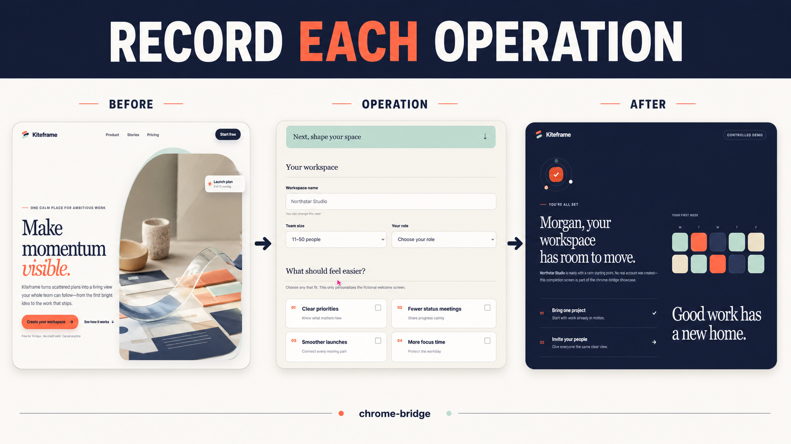

# chrome-bridge

chrome-bridge is a Chrome extension and HTTP MCP server that lets LLM agents operate every tab in the Chrome browser you use every day.

It operates your existing Chrome through accessibility snapshots, strict element references, and a virtual cursor, with the following principles:

- Do not select one tab at connection time; make every tab in every window available for operation.
- Provide tab listing, creation, closing, and selection as MCP tools.
- Use Streamable HTTP, rather than stdio, as the MCP transport.
- Implement the MCP server in Python with uv.

## Record individual operations

chrome-bridge can record one requested operation from its initial page state through
its visible result, without foregrounding the target tab. Add `video_filename` to a
wait, input, upload, or navigation/history tool and the extension saves a silent WebM
below `Downloads/chrome-bridge/`, including 500 ms before and after the operation.

[](https://youtu.be/pwjgqNSmTsI)

The 27-second showcase uses the self-contained, fictional
[Kiteframe demo](examples/recording-demo/README.md); it contains no real user, browser,
account, or machine data. For example, after taking a current snapshot and obtaining
the button ref:

```text
browser_click(
    element="Create my workspace button",
    ref="s12e7",
    video_filename="signup-submit.webm",
)
```

Omit `video_filename` to preserve the tool's original return value and avoid recording
overhead. The standalone `browser_record_video` tool records a bounded hold without
performing another page action.

The current vertical slice supports simultaneous connections from multiple Chrome profiles and provides the following 23 tools. When multiple browsers are connected, use `browser_instances` to find their IDs and pass `browser_id` to each tool. It may be omitted when only one browser is connected.

| Tool | Function |
| --- | --- |
| `browser_instances` | List IDs and labels of connected browser instances |
| `browser_tabs` | List tabs across all windows |
| `browser_tab_open` | Open an HTTP(S) URL or a blank tab |
| `browser_tab_close` | Close a tab by tab ID |
| `browser_tab_select` | Select the page-operation target without foregrounding Chrome UI |
| `browser_tab_activate` | Select the page-operation target and foreground its window |
| `browser_snapshot` | Capture an accessibility snapshot of the target tab |
| `browser_click` | Click a snapshot ref, optionally record the operation, and return a post-operation snapshot |
| `browser_hover` | Move to a snapshot ref, optionally record the operation, and return a post-operation snapshot |
| `browser_type` | Type into a snapshot ref, optionally record the operation, and return a post-operation snapshot |
| `browser_upload_file` | Assign local files to the chooser opened by a snapshot ref, optionally recording through the resulting snapshot |
| `browser_select_option` | Select values in a snapshot ref, optionally record, and return a post-operation snapshot |
| `browser_press_key` | Send a key or chord to the target tab, optionally recording the operation |
| `browser_navigate` | Navigate to an HTTP(S) URL, optionally recording through the post-operation snapshot |
| `browser_go_back` | Go back in history, optionally recording through the post-operation snapshot |
| `browser_go_forward` | Go forward in history, optionally recording through the post-operation snapshot |
| `browser_wait` | Wait for a specified number of seconds, optionally recording the target during the wait |
| `browser_wait_for` | Wait up to 10 seconds for accessible text to become visible or hidden, optionally record, and return a fresh snapshot |
| `browser_download_file` | Trusted-click a strict ref, wait up to 60 seconds for its target download, and return sanitized metadata plus a fresh snapshot |
| `browser_record_video` | Record the target tab as a bounded silent WebM below Downloads/chrome-bridge |
| `browser_screenshot` | Capture the target tab's viewport as PNG image content |
| `browser_get_console_logs` | Retrieve up to 100 console entries and exceptions from the target tab |
| `browser_drag` | Drag between two snapshot refs, optionally record, and return a post-operation snapshot |

## Comparison with similar tools

This feature comparison is based on public documentation available as of 2026-07-18. Because each project has a different scope, the table is intended as a guide for choosing a tool, not as a simple ranking.

| Item | chrome-bridge | [Browser MCP](https://docs.browsermcp.io/) | [mcp-chrome](https://github.com/hangwin/mcp-chrome) |
| --- | --- | --- | --- |
| Existing Chrome login state | Uses it | Uses it | Uses it |
| MCP transport | Streamable HTTP | stdio | Streamable HTTP and stdio |
| Operation target | Lists all windows/tabs and selects a persistent target | The current single tab connected through the extension popup | Tab-ID addressing and cross-tab operations |
| Background-tab operation | Target selection does not foreground; only explicit activation does | Operates the connected tab | `background` option on some tools (best effort) |
| Simultaneous routing to multiple Chrome profiles | Stable ID per installation | Not mentioned in public setup documentation | Not mentioned in public README |
| Element discovery and operation | Accessibility YAML and generation-scoped strict refs | Accessibility snapshot and element specification | Accessibility-like tree, refs, selectors, and coordinates |
| Local file upload | 1–20 files to the chooser opened by a strict ref | Not mentioned in public tool documentation | Not mentioned in public tool documentation |
| Operation-scoped video recording | Standalone bounded recording plus optional recording around wait, input, upload, and navigation/history operations | Not mentioned in public documentation or changelog | Not listed in the current public tool reference |
| Screenshot | Target viewport, orientation-aware Full HD bound | Connected tab | Viewport/full page/element, configurable size |
| Console logs | Up to 100 console entries/exceptions from the target | Supported | Supported |
| Network monitoring/arbitrary requests | Out of scope | Not mentioned in public tool documentation | Supported |
| History/bookmark management | Out of scope | Not mentioned in public tool documentation | Supported |
| Semantic cross-tab search | Out of scope | Not mentioned in public tool documentation | Supported |

Sources: [Browser MCP server setup](https://docs.browsermcp.io/setup-server),
[Browser MCP extension setup](https://docs.browsermcp.io/setup-extension),
[Browser MCP changelog](https://docs.browsermcp.io/changelog),
[mcp-chrome README](https://github.com/hangwin/mcp-chrome),
[mcp-chrome tool reference](https://github.com/hangwin/mcp-chrome/blob/master/docs/TOOLS.md).

## Structure

```text
apps/
└── extension/  # Manifest V3 Chrome extension
packages/
├── mcp/        # Python FastMCP + Streamable HTTP + WebSocket bridge
└── sdk/        # Direct API Python SDK and managed-server launcher
```

The MCP client connects to `http://127.0.0.1:8765/mcp`. The Chrome extension makes an outbound connection to `ws://127.0.0.1:8765/extension` and returns results from Chrome API operations.

Python applications can instead use `chrome-bridge-sdk` without an MCP client. Its
exclusive session is enforced by the shared server across processes, so target and
snapshot refs cannot be changed by another SDK workflow while the session is active.

```python
from chrome_bridge_sdk import ChromeBridge

chrome = ChromeBridge()

async with chrome.session() as session:
    tabs = await session.browser_tabs()
    await session.browser_tab_select(tab_id=tabs[0].id)
    snapshot = await session.browser_snapshot()
```

`session()` reuses a compatible server or starts a shared managed server automatically.
There are no public `open`, `close`, or `restart` methods; an SDK-started server exits
after five idle minutes. High-level operations return typed immutable models; `call()`
remains available when an integration needs the raw Direct API JSON result.

## Quick start

```bash
uv tool install chrome-bridge-mcp
chrome-bridge-mcp
```

For Python SDK use, install both distributions through the SDK dependency:

```bash
uv add chrome-bridge-sdk
```

1. Install [Chrome Bridge from Chrome Web Store](https://chromewebstore.google.com/detail/chrome-bridge/ogmocgobegbjbecakclahodnhhfmccad). The v0.1 release is Unlisted, so use this direct URL.
2. If needed, set a Browser label in Options to identify the profile.
3. Connect the MCP client to `http://127.0.0.1:8765/mcp`.

For source setup and Load unpacked development, see the
[development guide](docs/development.md).
For repeatable testing of the exact release ZIP, run
`uv run python scripts/prepare_unpacked_extension.py` and select the generated,
gitignored `unpacked-extension/` directory in Chrome once.

A typical Streamable HTTP configuration looks like this. Adjust field names for your MCP client.

```json
{
  "mcpServers": {
    "chrome-bridge": {
      "transport": "streamable-http",
      "url": "http://127.0.0.1:8765/mcp"
    }
  }
}
```

Connectivity check:

```bash
curl http://127.0.0.1:8765/health
uv run pytest
```

Local CI-equivalent validation:

```bash
uv sync --all-groups --locked
uv run ruff check packages/mcp packages/sdk scripts
uv run ruff format --check packages/mcp packages/sdk scripts
uv run pytest
uv run python scripts/validate_static.py
npm --prefix apps/extension ci
npm --prefix apps/extension run lint
npm --prefix apps/extension test
```

To run isolated E2E without using your everyday Chrome profile or default port 8765, install bundled Chromium once and invoke the test explicitly.

```bash
npm --prefix apps/extension exec playwright install --no-shell chromium
npm --prefix apps/extension run test:e2e
```

[GitHub Actions](.github/workflows/ci.yml) runs the same gates with Python 3.11/3.12, Node 20, and bundled Chromium.

Build reproducible extension ZIP and Python wheel/sdist artifacts with SHA-256 checksums, then run a clean-install smoke test:

```bash
uv run python scripts/build_release.py
uv run python scripts/validate_release.py
uv run python scripts/check_release_reproducible.py
```

The verified extension ZIP is also the Chrome Web Store submission artifact; do not create a separate Store build. See the [Chrome Web Store submission guide](docs/chrome-web-store.md) for the Unlisted-first rollout, listing assets, privacy declarations, permission justifications, reviewer instructions, and update automation. The public [privacy policy](PRIVACY.md) describes extension data handling.

See [docs/development.md](docs/development.md) for detailed procedures, [docs/api.md](docs/api.md) for the tool API, [docs/architecture.md](docs/architecture.md) for design, [docs/release.md](docs/release.md) for distribution, and [SPEC.md](SPEC.md) for the normative specification. [docs/operations.md](docs/operations.md) is canonical for routine operation, configuration, logging, and incident response.

## License

chrome-bridge is licensed under the [MIT License](LICENSE). Playwright-derived extension code remains under Apache-2.0; see [THIRD_PARTY_NOTICES.md](apps/extension/THIRD_PARTY_NOTICES.md) for provenance and license details.
