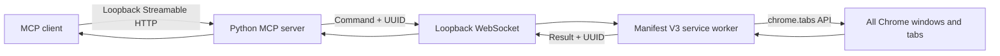
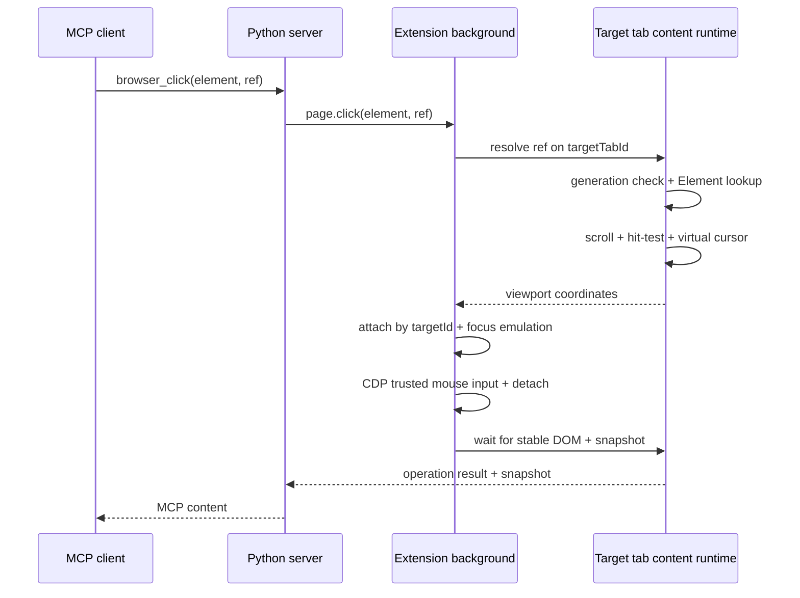

# Architecture

## Components



Because an extension cannot open a listening socket inside the browser, it connects outward to the server's loopback WebSocket. The MCP transport and extension protocol are separate, keeping Chrome API implementation details hidden from MCP clients.

## Server modules

- `config.py`: environment configuration and safe defaults
- `security.py`: ASGI guard for loopback Host/Origin
- `bridge.py`: extension connections, request correlation, timeouts, and tab controller
- `app.py`: composition of FastMCP tools, health endpoint, and WebSocket endpoint
- `__main__.py`: Uvicorn entry point

## Connection ownership

The server retains multiple connections in a `BrowserRegistry` keyed by a stable random ID per extension installation.

Because MCP is stateless, there is no server-global selected browser. Every tool except browser-instance discovery accepts optional `browser_id`; it may be omitted with one connection and is required with multiple connections. Unknown IDs and disconnects never fall back to or retry on another connection. Request correlation, pending futures, and send locks are isolated per connection, and only a reconnect with the same ID replaces the old socket with code 1012.

Adding identity to hello is not wire-compatible with the v1 schema, which rejects unknown fields, so identity uses protocol v2. During migration, the server also accepts v1 in a single legacy slot. See [Multiple browser routing](multiple-browser-routing.md) for the canonical ID-generation rules, public contract, health redaction, state transitions, and test matrix.

Automated validation of the production extension/server/MCP path uses two ephemeral persistent contexts in bundled Chromium, never a user profile or default port 8765. [Isolated Chrome E2E](isolated-chrome-e2e.md) is canonical for random loopback ports, temporary extension artifacts with replaced runtime config, process/profile cleanup, failure artifacts, and the boundary with manual branded-Chrome smoke tests.

## Extension protocol validation

Canonical JSON Schemas for protocol v1 commands/runtime and the v2 identity hello live in the server package as `protocol_v1.schema.json` and `protocol_v2.schema.json`. The Python server reads the package resources directly with a Draft 2020-12 validator, and the extension build embeds the same JSON in `dist/protocol.js`. Because schemas are not duplicated for the extension, build/tests can detect drift in the command catalog and parameters.

The server validates outgoing requests and pongs; the extension validates hellos, pings, and success/error responses before sending. Receivers validate with the same schemas. Because command-result shapes differ by tool, the envelope schema allows arbitrary JSON and `BrowserController` response validation remains the second layer.

Invalid command parameters that can be correlated by ID become extension error responses. Messages whose IDs cannot be trusted, malformed JSON, hello/runtime lifecycle violations, and invalid or unknown response IDs can be uncorrelatable or corrupt state, so the connection closes with code 1002. A server-side detach fails pending futures only for that connection.

## Target tab ownership

Chrome's `Tab.active` (the tab visible to the user) and the target tab to which the extension sends page commands are separate state. Page-operation tools do not accept `tab_id`; they route to the single `targetTabId` retained by the extension.

- `browser_tab_select(tab_id)` / `tabs.select` changes only the target and does not call `chrome.tabs.update(..., {active: true})` or `chrome.windows.update(..., {focused: true})`.
- `browser_tab_activate(tab_id)` / `tabs.activate` changes the target, then explicitly foregrounds the tab and window.
- `browser_tab_open` never changes the target implicitly. Explicitly select a newly created tab before operating it.
- Switching tabs in Chrome UI does not move the target.
- Closing the target tab clears the target and never selects another tab automatically.
- The target is shared state owned by the extension connection, not session state per MCP client.

To survive service-worker suspend/resume, save `targetTabId`, the extension-wide generation counter, and the target's latest snapshot generation in `chrome.storage.session`. Generation issuance is serialized in the service worker. State need not survive a browser restart; if the stored tab does not exist, clear it at startup. Each `browser_tabs` result returns `targeted` separately from Chrome's `active`.

Clear the latest snapshot generation on target selection and when `chrome.webNavigation.onCommitted` reports top-frame navigation on the target. Run an element operation only when the ref generation matches the target's latest snapshot generation and resolves in the content runtime's Map. Ordinary navigation retains the target tab ID.

The agent UI visualizes target ownership as `off`, `target`, or `operating`. It stores `operatingTabId` and a unique operation token in `chrome.storage.session`; only a command that has begun execution from the page-operation queue becomes operating. In `finally`, only a matching token clears the state, so stale cleanup cannot erase newer state. At startup, the content runtime queries the background for state and restores the indicator after navigation. This uses internal extension messages and does not change the extension protocol or MCP results.

The content runtime retains the latest page title as the logical title and applies target/operating prefixes to the Chrome tab. A MutationObserver tracks dynamic title changes, and clearing the target restores the latest logical title. Snapshot results omit the prefix. The top-right status and virtual cursor use separate Shadow DOM hosts, both removed from the old tab when the target changes.

This separation lets the agent operate background tabs without unnecessarily taking over the user's current work. If a background operation fails because of a focus-dependent site, permission prompt, clipboard, or browser-native UI, do not activate automatically; return an error that lets the caller choose `browser_tab_activate`.

## Page operation design

Page operations place a small content runtime in the top frame as a manifest-declared content script. Document navigation naturally destroys the runtime and Element Map. Only when an eligible HTTP(S) page opened before extension reload lacks the runtime does background `ensureContentRuntime(tabId)` inject the same bundle through `chrome.scripting.executeScript`; initialization is idempotent. The content runtime handles ARIA snapshots, element-ref resolution, clickable-point hit-testing, DOM stabilization, and the virtual-cursor overlay. The background handles tab lifecycle and Chrome debugger/console/screenshot operations. The initial version is top-frame-only; iframe support is a separate task.

The snapshot foundation requires `webNavigation`, `scripting`, and HTTP(S) host permissions in addition to `storage` and `tabs`. Click, hover, type, and key press also require `debugger` permission to send trusted input to background targets.

Extension source lives in `apps/extension/src`, version-pinned Playwright-derived source in `src/vendor`, and the Load-unpacked bundle at `apps/extension/dist/content-runtime.js`. esbuild generates a non-minified IIFE targeting Chrome 116 and leaves a link to the third-party notice at the beginning of the output.

ARIA snapshot tree generation, role/name/state calculation, and YAML rendering are based on Playwright 1.51.1 source published under Apache-2.0. The extension's third-party notice records provenance and local changes.

External refs use `s<generation>e<element-id>`, with the background issuing extension-wide generations. Assigning a different generation on every target change, navigation, and snapshot update prevents collisions across tabs/documents without expanding the ref string.

The content runtime retains the following for each snapshot:

```text
SnapshotState
├── generation: integer
├── root: AriaNode
├── elements: Map<integer, Element>
└── ids: Map<Element, integer>
```

Ref operations validate the generation and strictly resolve an `Element` from `elements`. Scrolling, coordinate acquisition, and DOM operations stay in the same content runtime wherever possible, avoiding mismatches from re-querying selectors after DOM changes. There is no fallback that guesses similar selectors.

Do not use `chrome.debugger.attach({tabId}, "1.3")`, because it made the target tab active in this test environment. Obtain the page `targetId` corresponding to the target tab from `chrome.debugger.getTargets()` and attach directly to `{targetId}`. Enabling renderer `Emulation.setFocusEmulationEnabled` only during input allows CDP input without changing Chrome UI's active tab/window focus. Disable focus emulation and detach afterward. If no page target is available, return an error; never fall back to a foregrounding `{tabId}` attachment.

Hover follows the same strict Element resolution, scrolling, hit-test, and virtual-cursor path as click, then sends only CDP `mouseMoved`. Type follows the same path, verifies that the Element is editable, focuses it with a trusted click, and sends `Input.insertText`; `submit=true` then sends an Enter chord. Select does not use the debugger: it validates every `option.value` on the saved `HTMLSelectElement`, changes selected state, and fires bubbling `input` and `change` events. Press key converts a `+`-delimited modifier chord or single key into keyDown/keyUp.

Click, hover, type, and select clear the latest snapshot after the operation, wait up to three seconds for one second of DOM stability, and return a new snapshot. Press key also clears the latest snapshot and waits for stability, but returns only a completion message, so the next element operation requires a new `browser_snapshot`.

Navigate accepts only HTTP(S) URLs, using `chrome.tabs.reload` for the current URL and `chrome.tabs.update` otherwise. Back/forward use `chrome.tabs.goBack` / `goForward`. Before issuing any operation, register listeners for top-frame commits, History API and fragment updates, navigation errors, and tab close, then clear the latest snapshot. After navigation begins, wait for target-tab load completion and the content runtime before generating a new snapshot.

If the Chrome tabs API reports no history, return a clear error without entering the navigation wait. If the history destination is restricted, such as `about:blank`, retain the target and return content-unavailable; later back/forward or HTTP(S) navigation can recover. Wait sleeps for 0–10 seconds inside the page-operation queue and clears the latest snapshot at start. It waits for elapsed time, not DOM stability; call `browser_snapshot` to inspect the current DOM afterward.

Screenshot does not branch on foreground/background. It temporarily attaches to page `targetId` without focus emulation, captures the CSS visual viewport from `Page.getLayoutMetrics` through `Page.captureScreenshot`, then uses a content-runtime canvas to downscale the actual image to at most 1024×768 while preserving aspect ratio. Because CDP `clip.scale` does not limit actual pixels on high-DPI displays, metadata width/height alone are not treated as proof of downscaling. The server validates base64 and the PNG signature, then converts it to MCP image content.

Console logs have no persistent global collector. Only during a tool call, attach to the same page `targetId` and call `Runtime.enable`; receive for 100 ms the buffered `Runtime.consoleAPICalled` and `Runtime.exceptionThrown` events Chrome replays for the current document, strictly filter by source target ID, and cap at 100. This contract returns current-document entries retained by Chrome Runtime and does not guarantee independent history across calls. Screenshot and console both detach in `finally` and never auto-activate the target.

Drag resolves start/end Elements from the same latest snapshot inside the content runtime. Only the start is scrolled to center; the start requires a clickable hit-test and the end a visible point in the viewport. Attach to page `targetId` with focus emulation, send move/press at start, five movement steps to end, and release. Attempt release even if movement fails, then detach through common `finally`. Ordinary HTML5 drag produces native drag/drop events from this mouse sequence, so do not layer synthetic DOM events or `Input.dispatchDragEvent`. On completion, move the cursor to the end and return a new snapshot after DOM stabilization.

The virtual cursor aligns the arrow tip with viewport coordinates, and the content runtime returns distance-dependent `settleMs`. The background waits for arrival before sending CDP input; click/type/select synchronize a press ripple, while drag synchronizes 180–500 ms interpolated movement and pressed state. The cursor remains at its last position while targeted. For screenshots, hide only the status host for two animation frames, capture the page including the cursor, and restore status in `finally`.

For file upload, the server validates and canonicalizes 1–20 absolute paths to existing regular files, then passes them to `page.uploadFile`. The extension resolves the strict-ref Element to a clickable point and attaches to page `targetId` with focus emulation. Before clicking, it enables `Page.setInterceptFileChooserDialog`; only the `backendNodeId` from `Page.fileChooserOpened` caused by the trusted click is passed to `DOM.setFileInputFiles`. It never searches for hidden or similar inputs by selector, and rejects a ref that opens no chooser after three seconds. Before assignment, it resolves the same `backendNodeId` with `DOM.resolveNode` and installs a temporary `change` barrier on the input. After assignment, the barrier confirms event dispatch and synchronous-listener completion before common DOM stabilization. Site-specific asynchronous uploads and thumbnail generation are not awaited indefinitely; callers observe them with `browser_wait` and a new snapshot. Multiple files for a single chooser are rejected before assignment. In `finally`, release the remote object, disable interception, and detach the debugger. Paths are never returned in results.



## Planned target video recording

Target-tab video recording is designed but its public API and production encoder are not
implemented. The shared debugger-session module is implemented and existing debugger
operations use it while retaining their attach/use/detach behavior. It serializes
critical work, can skip opportunistic capture under contention, observes external
detach, and owns an attachment only within one command. Future recording will pass that
session explicitly to recording and input helpers; it will not introduce a global
reference-counted attachment or retain a session across MCP commands.

The planned pipeline repeatedly captures the exact background target, sends frames to a
single offscreen document for canvas/MediaRecorder encoding, and downloads a silent WebM
below the Chrome profile's Downloads directory. Screenshot and video will share
orientation-aware Full HD bounds without cropping or upscaling. Navigation and upload
recording remain gated on lifecycle and cleanup measurements. An isolated E2E-only
offscreen/MediaRecorder/download probe has validated the pipeline without adding
production permissions. Full HD landscape and portrait probes dropped no frames, and a
capture already in flight added 18 ms mean and at most 30 ms queue delay to a real CDP
mouse-move input in the final cold-path run. See
[Video recording design](video-recording.md) for the canonical planned API, ownership,
dimensions, and validation order.

## Security decisions

- Validate Host and Origin as DNS-rebinding defenses required by the MCP transport specification.
- Reject binding outside `127.0.0.1` during configuration.
- Trust local processes running as the same user and require no shared token.
- A shared token is not an effective boundary against local-process compromise and adds extension configuration, so it is not used.
- Design authentication, encryption, and privilege separation together if remote binding is added.
- The health endpoint exposes only non-sensitive connection presence/count and, for a single connection, protocol/extension versions. It never returns browser IDs, labels, or tab/page data.
- Add only the minimum browser permissions per milestone. At the click milestone, use `tabs`, `storage`, `scripting`, `webNavigation`, `debugger`, and HTTP(S) host access.
