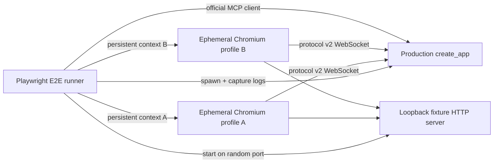

# Isolated Chrome end-to-end harness

## Status and objective

This document fixes the design and implemented contract for an automated end-to-end harness. The harness
must exercise the production Python app, WebSocket protocol, unpacked Manifest V3 extension, Chrome APIs, content
runtime, and public MCP tools without reading or modifying a user's normal Chrome profiles.

The existing unit and Playwright DOM tests remain the fast primary gates. This harness adds a small vertical smoke test;
it does not duplicate every page-operation fixture.

## Current platform evidence

Research and local probes were performed on 2026-07-16 with `@playwright/test` 1.61.1, its bundled Chromium
149.0.7827.55, and chrome-bridge extension 0.1.0.

Playwright's current extension guidance requires a persistent Chromium context and recommends the bundled Chromium
build because branded Chrome and Edge removed the command-line flags used to sideload extensions. The `chromium`
channel selects the unified/new headless implementation that supports extensions. Chrome also documents new headless as
the full browser implementation rather than the old headless shell.

Primary references:

- [Playwright Chrome extensions](https://playwright.dev/docs/chrome-extensions)
- [Playwright browser channels and new headless](https://playwright.dev/docs/browsers#chromium-new-headless-mode)
- [Chrome extension end-to-end testing](https://developer.chrome.com/docs/extensions/how-to/test/end-to-end-testing)
- [Chrome unified headless mode](https://developer.chrome.com/docs/chromium/headless)

The local headless probe used `chromium.launchPersistentContext()` with `channel: "chromium"`, two extension loading
flags, and an ephemeral user-data directory. It verified:

- Manifest V3 service worker URL `chrome-extension://coojkiickohflljlpefojehemhllaknh/background.js`;
- protocol v2 registration as a third isolated browser instance;
- inactive fixture tab creation and non-focusing target selection;
- generation 1 Accessibility snapshot and strict element ref;
- `chrome.debugger` attach/input/detach through `browser_click`;
- updated operation snapshot while the original `about:blank` tab remained active;
- registry count returning from three to the two user-owned connections after context close;
- removal of the temporary user-data directory.

This evidence selects bundled Chromium headless as both the local and GitHub-hosted Ubuntu path. Branded Chrome is not
the automated default.

## Test topology



One Playwright worker owns one complete topology. E2E tests run serially and never connect an isolated extension to the
normal port 8765. The server registry must be empty before either browser starts; a non-empty registry is a harness
failure rather than something to work around.

## Runtime extension artifact and configuration seam

The production default WebSocket URL is centralized in a small tracked ESM module:

```js
// runtime-config.js
export const DEFAULT_SERVER_URL = "ws://127.0.0.1:8765/extension";
```

`background.js` and `options.js` import this value. This prevents the two runtime consumers from drifting, but launching
the production artifact would still connect to a developer's real server on port 8765. Before launching Chromium, the
harness copies only runtime extension files into a temporary artifact directory and writes that artifact's
`runtime-config.js` with the random harness server URL. Source files and the tracked production config are never
modified. Both isolated profiles load the same temporary artifact path, while separate `chrome.storage.local` stores
produce separate stable browser IDs.

The copy allowlist is derived from the manifest plus transitive service-worker/UI imports. It excludes `node_modules`,
source tests, Playwright reports, and user data. Static validation should ensure the production config module exists and
the temporary artifact's manifest references all required files.

## Server and fixture lifecycle

The harness uses production `create_app(Settings(...))`; it does not mock `BrowserRegistry`, protocol validation, or MCP
tools. A small Python E2E server entrypoint may add readiness reporting and ephemeral-port ownership, but no test-only
route is added to the production ASGI app.

Preferred readiness contract:

1. The helper binds `127.0.0.1` on port 0 and retains the socket.
2. It starts Uvicorn with that pre-bound socket and production `create_app`.
3. After ASGI startup it writes one JSON readiness record containing the actual HTTP/MCP/WebSocket port to stdout.
4. All later stdout/stderr is captured as server diagnostics, not parsed as control messages.

Holding the bound socket removes the usual find-free-port race. If passing a pre-bound socket proves too coupled to
Uvicorn internals, the fallback is choose-and-retry up to three times, never a fixed port.

The fixture HTTP server is owned by the Node runner and listens on `127.0.0.1:0`, so its socket remains reserved from
allocation through teardown. It serves one deterministic page whose query/path selects profile A or B and whose button
updates only that document's status.

Startup order is server, fixture, temporary extension artifact, profile A, profile B, MCP client. Teardown is the exact
reverse and lives in fixture `finally` blocks:

1. Close MCP transport/session.
2. Close profile B and profile A contexts.
3. Stop the fixture HTTP server.
4. Send SIGTERM to the Python server and wait up to three seconds; use SIGKILL only if it does not exit.
5. Copy failure artifacts out, then recursively remove both user-data directories and the temporary extension artifact.

Early failure at any startup step still registers the resources already created for teardown. No child process or
profile directory may survive the test command.

## Browser identity and restart semantics

Start profile A and wait until `browser_instances` returns exactly one stable v2 instance. Record its browser ID. Then
start profile B and identify the new second ID by set difference. Do not depend on registry ordering, label uniqueness,
extension ID, tab ID, or connection timing.

To test reconnect, close profile A while retaining its user-data directory, wait for the registry to contain only B,
then relaunch a persistent context against the same A directory and temporary extension artifact. A must return with the
same browser ID. B's connection, target, and current snapshot must remain usable. A's `chrome.storage.session` target may
be clear after a browser restart and is not asserted.

At final teardown the user-data directories are deleted, so browser IDs are stable only within that test run.
Bundled Chromium headless did not restore A's fixture tab during the measured restart. Tab IDs and session restoration
are therefore not part of the identity contract: after reconnect the test opens a new A fixture tab for explicit-close
routing, while B's existing tab and target remain the uninterrupted-state assertion.

## Minimum E2E contract

The initial implementation contains one serial test with bounded waits and these assertions:

1. Health reports zero connections and exposes no browser identity.
2. Profiles A and B connect with distinct stable IDs, protocol version 2, and the expected extension version.
3. `browser_tabs` without `browser_id` returns an ambiguous error and sends no browser command.
4. Each ID opens the same fixture inactive, selects it without changing its original active tab, and returns provenance.
5. Both first snapshots contain the same ref text for the same fixture button, demonstrating the collision precondition.
6. Clicking A updates only A; type and drag update A through strict refs, and upload sets two temp files through a hidden
   multiple file input while its original tab remains active. Screenshot returns PNG content afterward.
7. A fresh B snapshot remains `Ready`; clicking B with its current ref updates only B.
8. An old ref is rejected as stale within its own profile.
9. Closing and relaunching A preserves A's browser ID and does not disturb B's target/snapshot.
10. Closing a fixture tab by explicit browser ID removes only that profile's tab.
11. Accessible text appears and disappears asynchronously in an inactive target;
    `browser_wait_for` returns fresh snapshots, invalidates the old ref, supports the
    recorded wrapper, and never changes the foreground tab.
12. Fresh strict refs start immediate and delayed downloads in the intended profile.
    Exact-target CDP metadata and a post-download snapshot are returned; timeout is
    outcome-unknown, cleanup permits the next snapshot/download, and created files alone
    are removed.
13. Context teardown returns health to zero connected browsers and removes temp upload and download files with the artifact root.

The test uses the MCP SDK's Streamable HTTP client rather than hand-written JSON-RPC so transport initialization and
content/structured result decoding are part of the vertical path. Unit tests remain responsible for timeout races,
malformed protocol frames, unknown response IDs, and exhaustive result validation.

## Service worker and debugger handling

Capture the first Manifest V3 service worker from `context.serviceWorkers()` or `waitForEvent("serviceworker")` and
verify its URL. Playwright documents that its Worker handle remains usable across normal MV3 idle suspension; a new
service-worker event is not expected. Calls already in flight at the exact suspension boundary may fail, so setup-only
worker evaluation is not used as a product assertion or retried invisibly.

The configuration seam removes the need to mutate extension storage through the worker. Product behavior is observed
through MCP. `browser_click` is the minimum debugger-backed command because it covers page-target discovery, debugger
permission, focus emulation, trusted input, detach, DOM stabilization, and a new snapshot. The active tab assertion
guards against a fallback to foregrounding `{tabId}` attach.

One optional slow test may wait beyond the MV3 idle interval and then call `browser_tabs`, but it should not block the
initial harness or every pull request until its runtime/flakiness is measured.

## Recording validation

The production manifest, protocol, offscreen encoder, and MCP catalog expose bounded
standalone recording. E2E calls `browser_record_video` against inactive 1920×1080 and
1080×1920 fixtures, verifies returned metadata and the downloaded EBML/WebM bytes,
removes that exact download, confirms the original active tab is unchanged, and
immediately calls the debugger-backed screenshot path. The rest of the two-profile
scenario covers click/type/drag/upload, isolation, cleanup, and restart.

E2E also records the maximum `browser_wait(time=10, video_filename=...)` through its
existing completion boundary plus 500 ms post-roll. It produced 106 frames and
approximately 110 KB on a 10,550 ms timeline without drops or server timeout, then
verified the conditional wrapper, unchanged active tab, exact deletion, and later
operations. A second recorded wait is externally detached while the tab remains
targeted: wait completes, recording returns the do-not-retry warning, no partial download
appears, and screenshot immediately reattaches to the same tab.

Playwright configures accepted downloads with `allowAndName`, which replaces Chrome's
chosen filesystem basename with a UUID. The ephemeral artifact therefore substitutes
only the result's Downloads-relative filename conversion. Production uses and validates
the completed Chrome Downloads item, and macOS/Windows conversion has unit coverage.
The harness still injects one internal input-contention probe; it does not inject
recording permissions, encoder files, protocol commands, or a hidden recording API.

The first cold 1280×720, 1.5-second run produced 15 frames and a 42,639-byte WebM in
1,581 ms, with 43 ms mean and 289 ms maximum `Page.captureScreenshot` time. Later
The final public-tool run produced 15 frames and approximately 58 KB without drops for
1.5-second 1920×1080, then exercised the maximum duration at 1080×1920: 100 frames,
approximately 117 KB, no drops, and a 10,008 ms recording timeline within the 15-second
server timeout. Earlier probe runs measured
landscape capture at 17–21 ms mean and up to 63 ms; portrait
measured 17–33 ms mean, with one 249 ms recording outlier and a 27 ms repeat maximum.

For input contention, each profile starts with five samples before recording: begin a
Full HD screenshot capture, immediately request a non-clicking
`Input.dispatchMouseEvent`, then separate queue delay from command duration. The cold
landscape run measured 18 ms mean and 27 ms maximum queue delay; portrait measured 18 ms
mean and 30 ms maximum. Input commands took at most 7 ms. This isolates recording-added
delay from the production focus-emulation settle. Branded Chrome and heavier pages remain
manual validation boundaries.

The production screenshot path now uses the same sizing helper. The isolated landscape
profile returned a 1920×1080 PNG as 92,259 bytes in 108 ms end to end through MCP; the
portrait profile returned 1080×1920 as 87,221 bytes in 125 ms. The test decodes each PNG
IHDR rather than trusting extension metadata and continues through the existing
two-profile lifecycle matrix.

## Failure artifacts and diagnostics

Diagnostics must explain failures without retaining entire browser profiles:

- capture Python server stdout/stderr from process start;
- record extension service-worker `console` messages and unhandled errors per profile;
- record page errors for fixture pages;
- start Playwright tracing on both contexts with screenshots and DOM snapshots;
- keep trace ZIPs only on failure;
- attach a bounded MCP transcript containing tool name, routing browser ID, timing, error flag, and fixture URL only;
- take final screenshots of fixture pages on assertion failure;
- include process exit code and cleanup errors without hiding the original failure.

Copy traces, screenshots, logs, and transcript into `testInfo.outputPath()` before removing temporary directories. Do not
attach Chrome storage databases, cookies, history, or complete user-data directories. The isolated fixture contains no
credentials, but artifact scope stays minimal by design.

## CI and manual smoke boundary

GitHub-hosted Ubuntu installs the full Playwright Chromium build and OS dependencies with:

```bash
npx playwright install --with-deps --no-shell chromium
```

`channel: "chromium"` uses unified headless; the default headless shell is not sufficient for this extension test. The
E2E job runs after the existing Python and extension jobs, uses one worker, has a 10-minute timeout, and uploads failure
artifacts only. Local macOS uses the same bundled Chromium path and supports an opt-in headed mode for debugging.

Automated bundled Chromium covers routing, protocol, Chrome tabs/storage/debugger APIs, content runtime, and
non-activation as represented by tab state. A short manual smoke test remains for:

- branded stable Chrome accepting the unpacked extension on macOS;
- popup and Options visual behavior;
- actual window focus not being stolen across two visible profiles;
- behavior under local enterprise policies or permission UI;
- logged-in pages when a future feature explicitly requires them.

Manual validation never becomes a prerequisite for ordinary pull requests.

## Implementation files

- `apps/extension/runtime-config.js`: production default server URL seam.
- `apps/extension/e2e/harness.js`: process, ports, artifact copy, contexts, MCP client, logs, teardown.
- `apps/extension/e2e/multiple-profiles.spec.js`: the minimum contract above.
- `apps/extension/playwright.e2e.config.js`: serial `channel: "chromium"`, timeouts, artifact policy.
- `apps/server/tests/e2e_server.py`: production app startup with pre-bound port and JSON readiness.
- `apps/extension/package.json` / lockfile: E2E scripts and MCP SDK development dependency.
- `.github/workflows/ci.yml`: isolated E2E job and failure-artifact upload.
- `scripts/validate_static.py`: production/runtime artifact config validation.

Suggested public helper signatures:

```js
async function startServer({ outputDir }) -> ServerHandle;
async function startFixtureServer() -> FixtureHandle;
async function prepareExtensionArtifact({ rootDir, serverUrl }) -> ArtifactHandle;
async function launchProfile({ artifactDir, userDataDir, tracePath, viewport }) -> ProfileHandle;
async function waitForInstances(client, predicate, timeoutMs) -> BrowserInstance[];
async function closeHarness(resources, testInfo) -> void;
```

`ServerHandle`, `FixtureHandle`, `ArtifactHandle`, and `ProfileHandle` each own an idempotent `close()` method. Resource
creation returns an owned handle immediately after allocation so teardown never depends on a later setup step succeeding.
