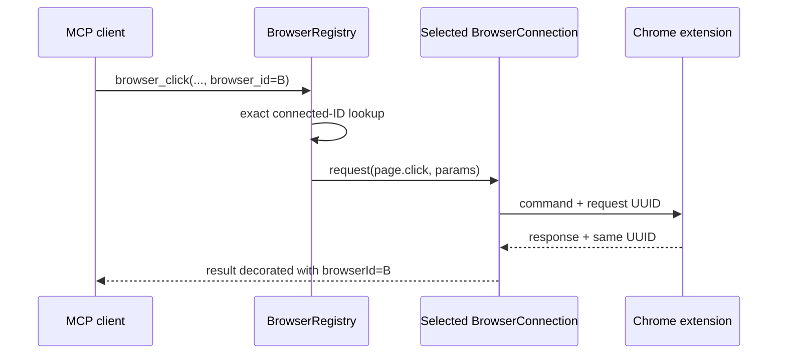
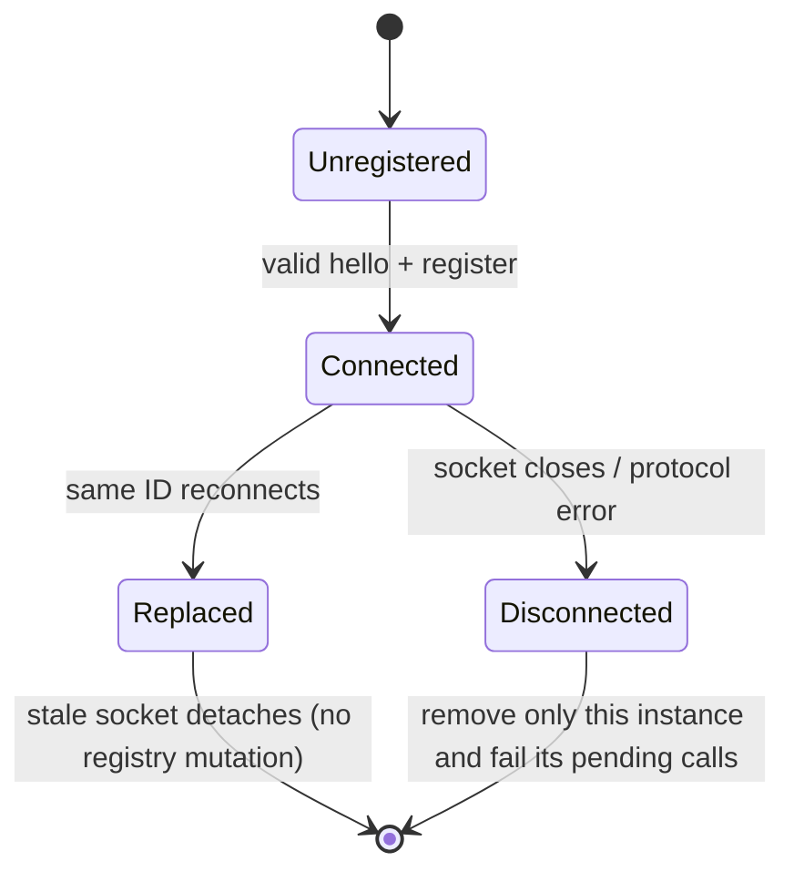

# Multiple browser routing

## Status and goals

This document fixes the implemented design for routing MCP calls to multiple Chrome extension installations. The primary
invariant is that a command is never sent to a browser other than the one selected by the
caller. Convenience fallback is allowed only when exactly one browser is connected.

An extension installation normally corresponds to one Chrome profile. The design deliberately does not inspect Chrome
profile paths, account names, cookies, or browsing data.

## Public MCP contract

Add one discovery tool and one optional argument to each of the existing 18 tools.

```python
async def browser_instances() -> list[BrowserInstance]: ...
async def browser_tabs(browser_id: str | None = None) -> list[Tab]: ...
# The other 17 existing tools add the same final optional browser_id argument.
```

`browser_instances` returns connected instances only. Its result uses the existing camelCase result convention:

```json
[
  {
    "browserId": "b9d746c1-e245-4f2d-9e5d-65fddf63c587",
    "label": "Work",
    "protocolVersion": 2,
    "extensionVersion": "0.1.0",
    "identityStable": true
  }
]
```

Labels are descriptive and need not be unique. Only `browserId` is used for routing. Tool resolution is deterministic:

1. An explicit `browser_id` must exactly match a currently connected instance.
2. An omitted `browser_id` resolves automatically only when exactly one instance is connected.
3. With no connection, the tool returns the existing extension-unavailable error.
4. With two or more connections, omission returns an error instructing the caller to invoke `browser_instances`.
5. An unknown or disconnected explicit ID returns an error and is never replaced by the only or newest connection.

A process-global `browser_select` tool is rejected. FastMCP runs with `stateless_http=True`; a mutable selection would be
shared by unrelated MCP clients and concurrent calls could be redirected between selection and execution. Requiring an
ID on ambiguous calls keeps routing local to the call without introducing MCP session state.

For compatibility, single-browser callers may continue using the existing schemas without `browser_id`. In a
multi-browser process, explicit identity is required for all operations, including tab listing. Tab IDs and snapshot refs
are profile-local and can collide, so the server never infers a browser from a tab ID or ref.

For stable v2 connections, the server adds `browserId` to structured tab and snapshot results after validating the
extension result. This is an additive provenance field and lets a client retain the identity used for a single-browser
implicit call. Legacy v1 results retain their old shape; their ephemeral ID is already required when v1 coexists with
another connection. Image and text content results are not wrapped merely to add provenance; their multi-browser calls
already require `browser_id`.

## Stable extension identity

On first startup, the extension generates `crypto.randomUUID()` and stores it as `browserId` in
`chrome.storage.local`. This store is installation/profile-local and survives service worker restarts and normal browser
restarts. Reinstalling the extension or clearing its local storage intentionally creates a new identity.

The ID is a canonical lowercase UUIDv4. It is random rather than derived from Chrome profile names, paths, Google
accounts, machine identifiers, tabs, or history. It is an opaque routing key, not authentication or authorization.

The extension also stores a user-editable `browserLabel` in `chrome.storage.local`. The initial value is
`Browser <first 8 ID characters>`. A label is trimmed, 1--64 Unicode characters, display-only, non-unique, and untrusted
when rendered. Options lets the user edit it; popup shows the local ID and label. Saving a changed label asks the service
worker to close and reconnect so the next hello atomically updates server registry metadata.

## Protocol version and migration

Identity uses protocol v2. Its command and response envelopes remain the same as v1, while hello becomes:

```json
{
  "type": "hello",
  "protocolVersion": 2,
  "extensionVersion": "0.1.0",
  "browserId": "b9d746c1-e245-4f2d-9e5d-65fddf63c587",
  "browserLabel": "Work"
}
```

`browserId` and `browserLabel` are required in v2. This is not called an additive v1 change: the canonical v1 schema
sets `additionalProperties: false`, so an existing v1 server rejects those fields. A version increment accurately
describes that wire incompatibility.

The new server accepts both protocols during migration:

- v2 connections use their stable browser ID and may coexist.
- v1 connections receive a server-generated ephemeral UUID and label `Legacy browser`; `identityStable` is false.
- At most one v1 legacy connection exists. A newer v1 connection replaces only the previous v1 connection.
- A v1 connection never replaces a v2 connection, and a v2 connection never replaces an unrelated ID.
- The deployment order is server first, extension second. The current server accepts only v1 and will correctly reject a
  v2 hello rather than silently ignoring its identity.

Supporting v1 is a migration mechanism, not a permanent identity substitute. The ephemeral ID changes across reconnects
and server restarts, and `browser_instances` exposes this through `identityStable: false`.

## Server ownership model

Replace the singleton `BridgeHub` connection state with a process-local `BrowserRegistry` and isolated
`BrowserConnection` objects.

```text
BrowserRegistry
├── connections: Map<browserId, BrowserConnection>
├── legacyBrowserId: UUID | None
└── resolve(browserId | None) -> BrowserConnection

BrowserConnection
├── browserId, label, protocolVersion, extensionVersion, identityStable
├── socket
├── pending: Map<requestId, Future>
└── sendLock
```

The WebSocket endpoint validates hello before registering a connection, retains the returned connection object, and
delivers later messages only to that object. Request IDs are correlated inside the selected connection rather than in a
global pending map. A response ID unknown to that connection is a protocol violation even if another connection has a
matching pending ID; only the offending socket is closed.

Attaching the same stable v2 ID atomically installs the replacement in the registry before awaiting I/O, then closes the
old socket with code 1012 and fails only the old connection's pending commands. Attaching a different ID leaves existing
connections untouched. Detaching an old socket after replacement is a no-op, identified by object/socket identity.
Disconnect and protocol errors fail only the pending commands owned by that connection. No failed or timed-out command
is retried on another browser.

The extension command envelope does not include `browserId`: the registry resolves the destination before a command is
sent over one already identified WebSocket. The extension's `targetTabId`, snapshot generation, and element map remain
local to that extension installation.



## Connection state machine



Different IDs create independent `Connected` states. The registry has no "active", "current", or "most recently
connected" browser. Chrome UI foreground state is also irrelevant: routing chooses an extension instance, then that
extension operates its own target tab with the existing non-focusing behavior.

## Health, UI, and security boundaries

`GET /health` remains unauthenticated and therefore does not reveal IDs, labels, tabs, URLs, titles, or page state. It
returns `status`, backward-compatible `extensionConnected`, and `connectedBrowserCount`. The existing `extension` field
contains protocol/extension version only when exactly one browser is connected; it is `{}` for zero or multiple browsers
because there is no unambiguous singular extension.

`browser_instances` may expose the routing ID and user-supplied label because MCP already has the authority to operate
the loopback-connected browsers under the project's local-process trust model. It must not include profile paths,
accounts, tab data, or other derived identifiers.

Popup displays only its own extension identity, connection state, and target tab. Options edits only its own label and
server URL. Neither UI lists metadata from other connected profiles. IDs and labels do not expand the security boundary:
loopback bind plus Host/Origin checks remain mandatory, and remote bind still requires a separate authentication design.

## Test matrix

| Case | Expected result |
| --- | --- |
| No connections, omitted ID | Extension-unavailable error |
| One v2 connection, omitted ID | Routes to that connection |
| Two connections, omitted ID | Ambiguous error; no command sent |
| Explicit connected ID | Routes only to exact connection |
| Unknown/disconnected explicit ID | Error; no fallback |
| Two v2 IDs connect | Both remain connected |
| Same v2 ID reconnects | Old socket gets 1012; only its pending calls fail |
| Stale replaced socket detaches | Replacement remains registered |
| One browser disconnects during command | Only its future fails; other browser remains usable |
| Timeout or extension error | No retry on another browser |
| Response ID belongs to another connection | Offending connection gets 1002; no cross-resolution |
| Duplicate labels | Both listed and routed by distinct IDs |
| v1 then v1 | New legacy socket replaces old legacy socket only |
| v1 and v2 | Both coexist; legacy reports unstable identity |
| Server restart | Registry starts empty; v2 reconnects with same stored ID |
| Label edit | Reconnect updates metadata without changing ID |
| Empty tab list | Empty list; selected connection still deterministic |
| Same tab ID/ref text in two profiles | Explicit browser ID prevents cross-profile operation |
| Health with multiple profiles | Count only; no ID, label, tab, or page metadata |

Tests should cover registry units with fake sockets, protocol v1/v2 schema fixtures, concurrent calls to different
connections, FastMCP tool schemas for all optional `browser_id` arguments, health redaction, extension local-storage
identity, reconnect behavior, and a real-Chrome two-profile validation before declaring the implementation complete.

## Implemented order

1. Add canonical protocol v2 schema/validators while retaining v1 receive support.
2. Add extension local identity, label Options/popup UI, and v2 hello/reconnect behavior.
3. Introduce `BrowserRegistry`/`BrowserConnection`, per-connection correlation, and redacted health count.
4. Add `browser_instances`, optional `browser_id` to all 18 tools/controller methods, exact resolution, and provenance.
5. Run automated tests, then validate two unpacked-extension profiles without foregrounding either target tab.

The registry and public routing ship together. A state where multiple connections are accepted while some tools still
route through a singleton is not a valid intermediate release.
